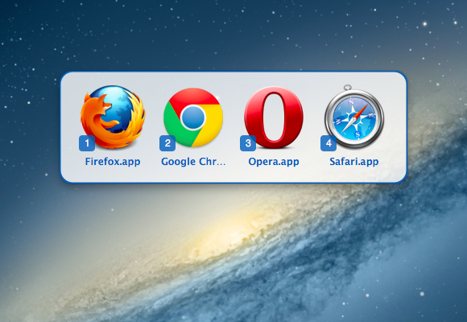

Objektiv
========================================

![Objektiv Logo][logo] Objektiv is a utility that lets you switch your
default browser easily. You might find it useful if you're a web
designer or use multiple browsers in your workflow.

Install
----------------------------------------

The app works with Mac OS X 10.8 (Mountain Lion) onwards.

You can either **[download Objektiv][download]** or install it via homebrew: `brew install objektiv`

Features
----------------------------------------

 - A status-bar icon for quick access
 - An optional global hotkey triggers an overlay window for even quicker
   switching
 - Pressing Option (⌥) in the status menu lets you hide browsers that
   are incorrectly detected

Usage
----------------------------------------
Due to the recent changes in MacOS 10.10+, applications are now incapable of switching the user's default browser silently without a confirmation message. Please set Objektiv as your default browser in your System Prefences > General and everything will work as normal.

Building & Running
----------------------------------------

Objektiv requires [CocoaPods][] in order to be built.

After cloning this repository, run:

    $ pod install

in order to grab dependencies. Also, make sure that you open
`Objektiv.xcworkspace`, not `Objektiv.xcodeproj`.

Copyright & About
----------------------------------------

Objektiv was built by the former web development company *nth loop* to solve
a problem they were facing and to learn all about developing Mac Apps.
It might be ridiculously over-engineered for such a simple utility.

Copyright 2012, [nth loop][]. Objektiv is available under the MIT
License.

Contributors
----------------------------------------

* [Anks](https://github.com/Anks), original developer
* [xrivatsan](https://github.com/xrivatsan), original developer
* [Vorror](https://github.com/Vorror), major bugfixes and making the tool work with present-day macOS

Credits
----------------------------------------

  - [ZeroKit][] by eczarny (MIT Licensed, portions of source used)
  - [MASShortcut][] by Vadim Shpakovski (BSD Licensed)
  - [CDEvents][] by Aron Cedercrantz (MIT Licensed)
  - [Sparkle][] by Andy Matuschak
  - [NSWorkspace+Utils][1] from Mozilla's Camino project (MPL)

  [logo]:        Objektiv/Objektiv.iconset/icon_128x128.png
  [download]:    https://github.com/nthloop/Objektiv/releases
  [nth loop]:    http://nthloop.com
  [CocoaPods]:   http://cocoapods.org/
  [ZeroKit]:     https://github.com/eczarny/zerokit
  [MASShortcut]: https://github.com/shpakovski/MASShortcut
  [CDEvents]:    http://aron.cedercrantz.com/CDEvents/
  [Sparkle]:     http://sparkle.andymatuschak.org/
  [1]:           http://hg.mozilla.org/camino/file/6d654a6d1cf4/src/extensions/NSWorkspace%2BUtils.h
